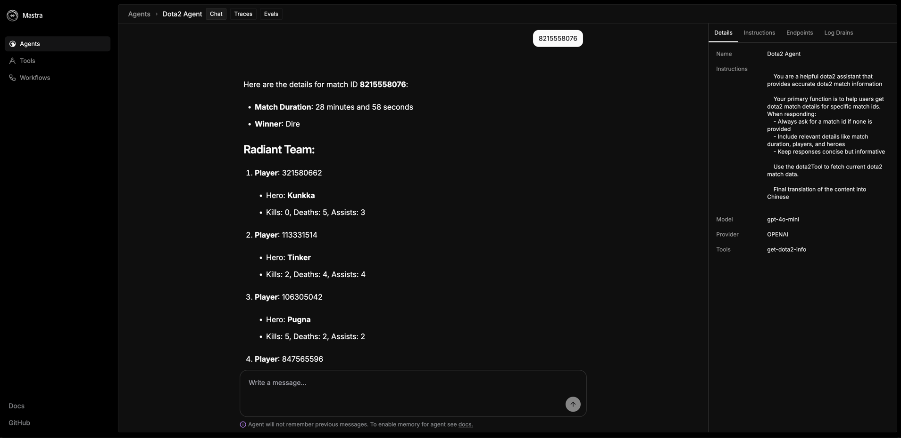

# Dota2 比赛助手

[English](./README.md) | 简体中文

一个用于获取Dota 2比赛信息的AI助手。



## 概述

Dota2 比赛助手是一个专门设计用于查询Dota 2比赛数据的AI代理。通过提供比赛ID，用户可以获取详细的比赛信息，包括：

- 比赛持续时间
- 获胜方（天辉/夜魇）
- 双方队伍的玩家信息（英雄ID、击杀、死亡、助攻）

## 技术实现

本项目使用以下技术栈：

- Mastra Core框架用于创建AI代理和工具
- OpenAI的GPT-4o-mini模型提供对话能力
- OpenDota API获取实时比赛数据

## 安装指南

### 前提条件

- 有效的OpenAI API密钥

### 安装步骤

1. 克隆仓库
```bash
git clone https://github.com/yourusername/dota2-match-agent.git
cd dota2-match-agent
```

2. 安装依赖
```bash
npm install
```

3. 配置环境变量
   在项目根目录创建一个`.env.development`文件并添加以下内容：
```
OPENAI_API_KEY=your_openai_api_key_here
```

4. 启动服务
```bash
npm run dev
```

## API参考

本项目利用OpenDota的公开API获取比赛数据。有关API详情，请参考：https://docs.opendota.com/#section/Introduction
